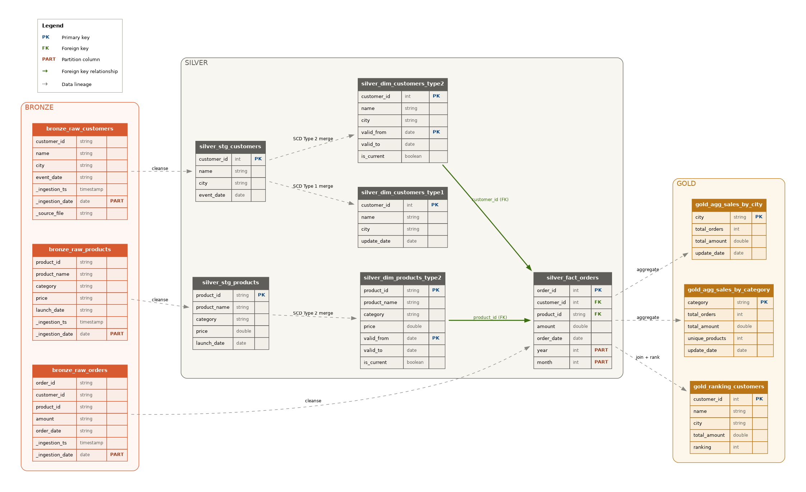
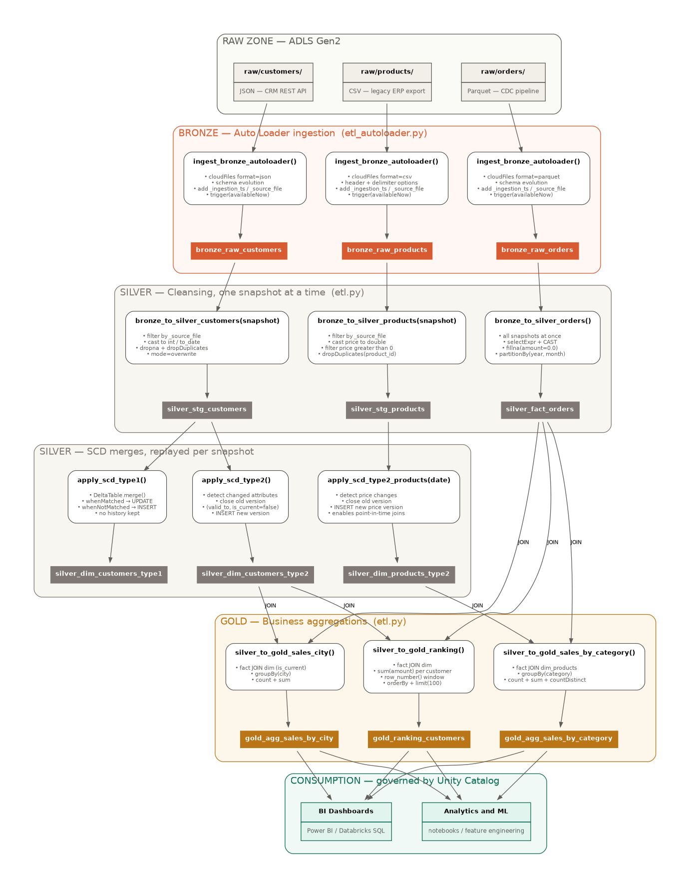

# Medallion Architecture + SCD + PySpark — Azure Databricks Lakehouse

A production-grade **Lakehouse pipeline** built and deployed on **Azure Databricks** with **PySpark**, **Delta Lake** and **Unity Catalog**.

The project brings together four pillars of modern Data Engineering:

- **Medallion Architecture** — Bronze, Silver and Gold layers
- **Slowly Changing Dimensions** — Type 1 and Type 2 implemented with Delta Lake `MERGE`
- **Auto Loader** — incremental multi-format ingestion (JSON, Parquet, CSV) from ADLS Gen2
- **Unity Catalog governance** — external locations, tags, RBAC, column masking and row-level security

---

## Physical Data Model



## Pipeline Workflow



---

## The scenario

A retail company receives data from three source systems, each delivering a different file format — a pattern that shows up in almost every enterprise environment:

| Source | Format | Simulates |
|--------|--------|-----------|
| **Customers** | JSON | CRM REST API (Salesforce, HubSpot) |
| **Orders** | Parquet | CDC pipeline (Debezium, Fivetran) |
| **Products** | CSV | Legacy ERP export |

Two snapshots demonstrate the dimensions changing over time:

**January 2026** — 3 customers, 4 products, 4 orders.

**June 2026** — customers move (John → Mountain View, Mary → Cupertino), a new customer joins, the iPhone price drops from $999 to $899, the T-Shirt goes up from $29.90 to $34.90, and a new product launches.

Because the product dimension is versioned, an order placed in February still joins to the $999 price, while a June order joins to $899. That is the **point-in-time join** that SCD Type 2 exists to enable.

---

## Architecture

### Storage layout (ADLS Gen2)

```
abfss://medallion@<storage-account>.dfs.core.windows.net/
│
├── raw/                          ← source files land here
│   ├── customers/  *.json
│   ├── orders/     *.parquet
│   └── products/   *.csv
│
├── lakehouse/                    ← external Delta tables
│   ├── bronze/
│   ├── silver/
│   └── gold/
│
└── _system/                      ← managed by Auto Loader and Unity Catalog
    ├── checkpoints/
    ├── schemas/
    └── catalog/
```

### Tables

Namespace: `medallion.medallion_scd.<table>`

**Bronze** — raw ingestion, no transformation
- `bronze_raw_customers` · `bronze_raw_orders` · `bronze_raw_products`

**Silver** — cleansed and modeled
- `silver_stg_customers` · `silver_stg_products` — staging
- `silver_dim_customers_type1` — SCD Type 1 (overwrite)
- `silver_dim_customers_type2` — SCD Type 2 (address history)
- `silver_dim_products_type2` — SCD Type 2 (price history)
- `silver_fact_orders` — fact table, partitioned by year/month

**Gold** — business aggregations
- `gold_agg_sales_by_city` · `gold_agg_sales_by_category` · `gold_ranking_customers`

### Authentication

No credentials appear anywhere in the code. Unity Catalog handles storage access through:

```
Azure Access Connector (Managed Identity)
        ↓  Storage Blob Data Contributor
Storage Credential  →  External Location  →  abfss://...
```

---

## Repository structure

```
medallion-scd-pyspark/
│
├── README.md
│
├── docs/
│   ├── data_model.png / .svg     ← physical data model (ERD)
│   └── workflow.png / .svg       ← end-to-end pipeline
│
├── create_tables.py              ← DDL: 12 external Delta tables
├── etl_autoloader.py             ← Bronze ingestion via Auto Loader
├── etl.py                        ← Silver + Gold, SCD Type 1 and Type 2
├── sql_queries.py                ← query demos: all join types, unions, time travel
│
├── unity_catalog_setup.sql       ← governance: tags, RBAC, masking, row filters
├── validation.sql                ← post-run integrity checks
├── workflow_job.json             ← Databricks Workflow (serverless, 2 tasks)
│
└── sample_data/                  ← files to upload to the raw zone
    ├── customers/  *.json
    ├── orders/     *.parquet
    └── products/   *.csv
```

---

## How the pipeline runs

```
raw/ files
    │
    ▼  etl_autoloader.py     — Auto Loader, trigger(availableNow)
Bronze tables
    │
    ▼  etl.py                — cleansing, SCD merges, aggregations
Silver + Gold tables
    │
    ▼  validation.sql        — integrity checks
BI / analytics
```

### Snapshot-based processing

Auto Loader ingests every available file at once, so Bronze holds several daily snapshots side by side. Processing them together would make deduplication pick an arbitrary version of each entity and leave SCD Type 2 with no history to record.

`etl.py` therefore replays Bronze **one snapshot at a time, in chronological order**, identifying each batch by its source file. The SCD merges run once per snapshot — which is exactly what produces the version history.

---

## Setup

### 1. Azure resources

| Resource | Purpose |
|----------|---------|
| Storage Account (ADLS Gen2, HNS enabled) | data lake |
| Container | holds `raw/`, `lakehouse/`, `_system/` |
| Access Connector for Azure Databricks | managed identity for Unity Catalog |
| Azure Databricks workspace (**Premium**) | Unity Catalog requires Premium |

Grant the Access Connector the **Storage Blob Data Contributor** role on the storage account.

### 2. Unity Catalog

In the Databricks Catalog Explorer:

1. Create a **Storage Credential** of type `Azure Managed Identity`, pointing to the Access Connector resource ID.
2. Create an **External Location** with that credential, pointing to `abfss://<container>@<account>.dfs.core.windows.net/`.
3. Run **Test connection** — Read, List, Write and Delete must succeed.

### 3. Configuration

Adjust the storage path at the top of `create_tables.py`, `etl_autoloader.py` and `etl.py`:

```python
CATALOG      = "medallion"
SCHEMA       = "medallion_scd"
STORAGE_BASE = "abfss://<container>@<account>.dfs.core.windows.net"
```

### 4. Execution order

```
1. unity_catalog_setup.sql   (sections 2–6)   — catalog, schema, grants
2. create_tables.py                           — 12 external tables
3. Upload sample_data/ to raw/
4. etl_autoloader.py                          — Bronze
5. etl.py                                     — Silver + Gold
6. validation.sql                             — verify results
7. unity_catalog_setup.sql   (sections 7–8)   — masking + row filters
```

Sections 7 and 8 come last on purpose: the row filter hides non-current SCD versions from anyone outside `data_engineers`, which would obscure the history during validation.

### 5. Scheduling

Import `workflow_job.json` into **Jobs & Pipelines** to run the pipeline on a schedule. Two tasks, `bronze_ingestion → silver_gold_transformations`, on serverless compute, with retries tuned per failure type.

---

## Governance

`unity_catalog_setup.sql` applies:

**Documentation** — a `COMMENT` on every table, visible in Catalog Explorer.

**Tags** — `layer`, `domain`, `scd_type`, `contains_pii` at table level; `pii` and `classification` at column level. Enables queries like "every table containing PII".

**RBAC** — three personas with different reach:

| Group | Access |
|-------|--------|
| `data_engineers` | full access to all layers |
| `data_analysts` | read-only on Gold |
| `data_scientists` | read-only on Silver and Gold |

Bronze is never exposed outside the pipeline.

**Column masking** — a function checks group membership and returns either the real value or `XXXX`. Same table, same query, different result per identity.

**Row-level security** — a row filter restricts non-engineers to `is_current = true`, hiding the historical audit trail while keeping it intact for the pipeline.

---

## PySpark techniques demonstrated

**Columns** — `select`, `selectExpr`, `col`, `withColumn`, `cast`, `alias`, `lit`

**Rows** — `filter` / `where`, `dropDuplicates`, `dropna`, `fillna`, `orderBy`, `limit`

**Joins** — inner, left, right, outer, cross, left_anti, left_semi, `union`

**Dates** — `to_date`, `year`, `month`, `current_date`, `date_add`

**Aggregation** — `groupBy`, `agg`, `count`, `countDistinct`, `sum`

**Windows** — `Window.orderBy`, `row_number`

**Delta Lake** — `MERGE` via both the `DeltaTable` API and SQL, schema evolution, partitioning, time travel (`VERSION AS OF`)

**Streaming** — Auto Loader `cloudFiles`, schema inference and evolution, checkpointing, `trigger(availableNow=True)`

---

## Design decisions

**External tables over managed tables.** Explicit control of physical location, portability across workspaces, and clearer auditability.

**Bronze keeps everything as string.** Casting during ingestion means a dirty record either breaks the job or gets silently dropped. Storing raw allows reprocessing without going back to the source.

**Staging is overwritten, dimensions are merged.** Staging only feeds the current batch; dimensions accumulate and must preserve what already exists.

**`MERGE` instead of separate `INSERT` and `UPDATE`.** A single ACID transaction — no window where a dimension could end up with two current versions or none.

**Fact partitioned by year/month, not by day.** Daily partitions on this volume would create thousands of tiny files, the classic small-files problem.

**`trigger(availableNow=True)` instead of continuous streaming.** Data arrives once per day; keeping compute running around the clock buys nothing.

---

## References

- [Databricks — Medallion Architecture](https://www.databricks.com/glossary/medallion-architecture)
- [Databricks — Auto Loader](https://docs.databricks.com/aws/en/ingestion/cloud-object-storage/auto-loader/)
- [Delta Lake — MERGE](https://docs.delta.io/latest/delta-update.html)
- [Unity Catalog on Azure](https://learn.microsoft.com/en-us/azure/databricks/data-governance/unity-catalog/)
- [Kimball Group — Slowly Changing Dimensions](https://www.kimballgroup.com/data-warehouse-business-intelligence-resources/kimball-techniques/dimensional-modeling-techniques/type-2/)
